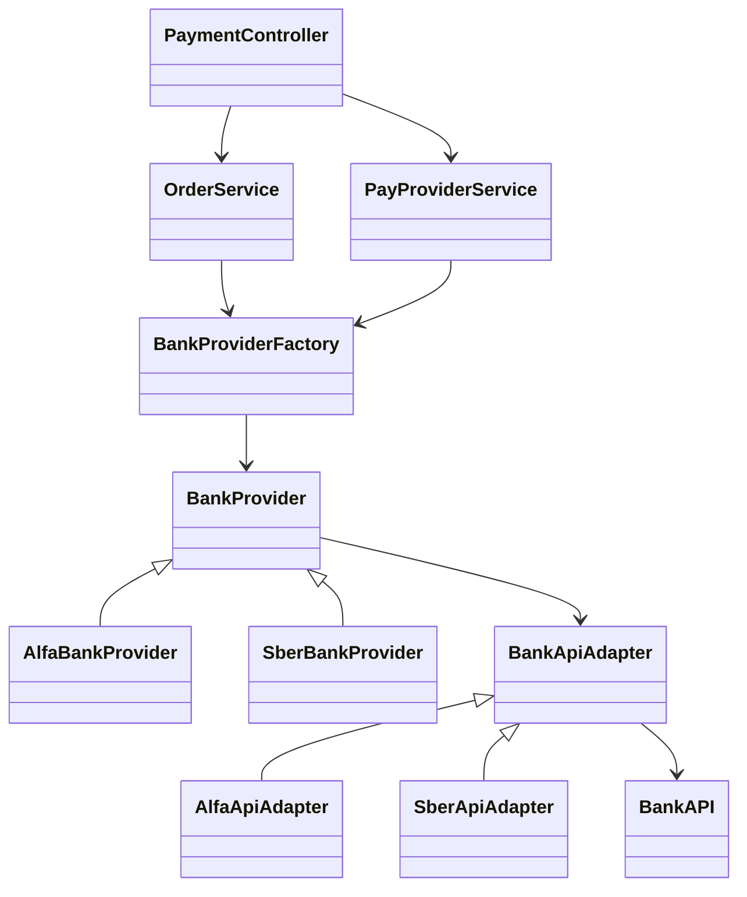

# payment-api-lumen (PHP)

REST API для оплаты заказов.

## Структура проекта
- `bootstrap/app.php` — регистрация сервисов, middleware, провайдеров.
- `routes/api.php` — все API маршруты.
- `app/Http/Controllers` — контроллеры.
- `app/Http/Middleware/TokenAuth.php` — проверка PAT в запросах.
- `app/Services/TokenService.php` — выпуск и хранение PAT в Redis.
- `config/services.php` — настройки token issuer.
- `config/database.php` — настройки Redis.

## Схема работы
Запрос к оплате проходит через слой контроллера и сервисов, затем фабрика выбирает провайдера банка, а адаптер делает вызов внешнего API банка и возвращает результат.

Схема:


Классы:
1. **Контроллер**: [PaymentController](app/Http/Controllers/Payments/PaymentController.php).
2. **Сервис**: [OrderService](app/Services/Payments/OrderService.php), [PayProviderService](app/Services/Payments/PayProviderService.php).
3. **Фабрика**: [BankProviderFactory](app/Services/Payments/Providers/BankProviderFactory.php).
4. **Провайдер**: [AlfaBankProvider](app/Services/Payments/Providers/AlfaBankProvider.php), [SberBankProvider](app/Services/Payments/Providers/SberBankProvider.php).
5. **Адаптер**: [AlfaApiAdapter](app/Services/Payments/Providers/Adapters/AlfaApiAdapter.php), [SberApiAdapter](app/Services/Payments/Providers/Adapters/SberApiAdapter.php).


## Взаимодействие
Внешний сервис заказов вызывает API по цепочке:
1. `POST /api/token` — получить сервисный токен.
2. `POST /api/v1/pay` — выполнить оплату с токеном.
3. Ответ — результат создания платежа.
4. `GET /api/v1/check` — проверка оплаты.

Пример заголовка:
```
Authorization: Bearer <token>
```

## Авторизация
 Для авторизации сервисов (с заказами, которые нужно оплатить) реализован Personal Access Token (PAT), который нужно получить перед началом сессии.
- Токен выдается после проверки `X-Service-Name` и `X-Service-Secret`.
- В Redis хранится не токен, а его SHA-256 хэш.
- Есть TTL токена (по умолчанию 86400 секунд).
- Токен передается в `Authorization: Bearer ...`.
