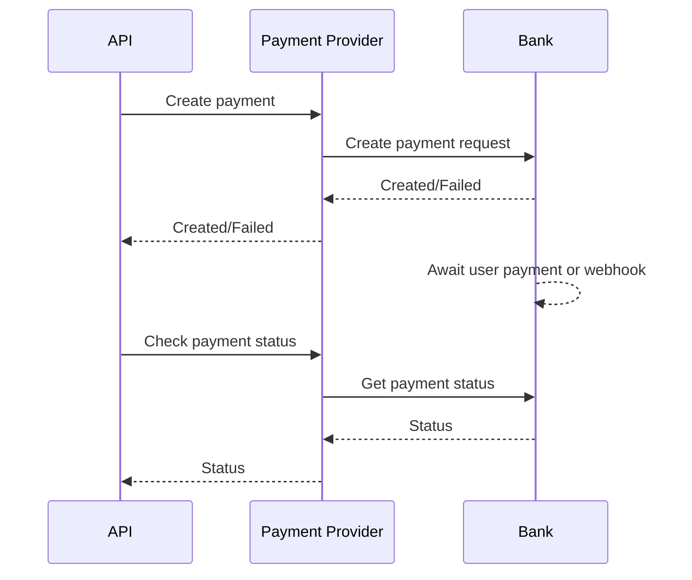

# payment-api-lumen (PHP)

REST API для оплаты заказов.

## Структура проекта
- `bootstrap/app.php` — регистрация сервисов, middleware, провайдеров.
- `routes/api.php` — все API маршруты.
- `app/Http/Controllers` — контроллеры.
- `app/Http/Middleware/TokenAuth.php` — проверка PAT в запросах.
- `app/Services/TokenService.php` — выпуск и хранение PAT в Redis.
- `config/services.php` — настройки token issuer.
- `config/database.php` — настройки Redis.

## Схема работы
Работа сервиса заключается в оплате заказа (товара) через одну из многих платежных систем. Заказ должен быть предварительно собран в объект и передан в этот сервис (API). Далее сервис пытается оплатить этот заказ. Оплата происходит не сразу, а через некоторое время, т.к. требуется подтверждение от юзера.
1. (API) Создается платеж через провайдера.
2. (Bank) В ответ получаем: платеж создан успешно или ошибка.
3. (Bank) Ожидаем оплаты от пользователя (по времени или вебхук от банка).
4. (API) Проверяем статус платежа через провайдера.
5. (Bank) В ответ получаем один из статусов платежа.

## Реализация
Внешний сервис заказов вызывает API по цепочке:
1. `POST /api/token` — получить сервисный токен с которым можно будет делать остальные запросы.
2. `POST /api/v1/pay` — выполнить оплату заказа.
Схема объекта заказа (JSON):
```json
    {
        "productId": "string12345",
        "email": "fedya@rosahutor.com",
        "amount": 5,
        "price": 5100.55,
        "currency": "RUB",
        "apiSecret": "string12345",
        "payProviderName": "alfa"
    }
```
3. Ответ — результат создания платежа.
4. `GET /api/v1/check` — проверка оплаты.

## Авторизация
 Для авторизации сервисов (с заказами, которые нужно оплатить) реализован Personal Access Token (PAT), который нужно получить перед началом сессии.
- Токен выдается после проверки `X-Service-Name` и `X-Service-Secret`.
- В Redis хранится не токен, а его SHA-256 хэш.
- Есть TTL токена (по умолчанию 86400 секунд).
- Токен передается в `Authorization: Bearer ...`.


### Классы

Основные классы реализующие логику API:
1. **Контроллер**: [PaymentController](app/Http/Controllers/Payments/PaymentController.php).
2. **Сервис**: [OrderService](app/Services/Payments/OrderService.php), [PayProviderService](app/Services/Payments/PayProviderService.php).
3. **Фабрика**: [BankProviderFactory](app/Services/Payments/Providers/BankProviderFactory.php).
4. **Провайдер**: [AlfaBankProvider](app/Services/Payments/Providers/AlfaBankProvider.php), [SberBankProvider](app/Services/Payments/Providers/SberBankProvider.php).
5. **Адаптер**: [AlfaApiAdapter](app/Services/Payments/Providers/Adapters/AlfaApiAdapter.php), [SberApiAdapter](app/Services/Payments/Providers/Adapters/SberApiAdapter.php).


